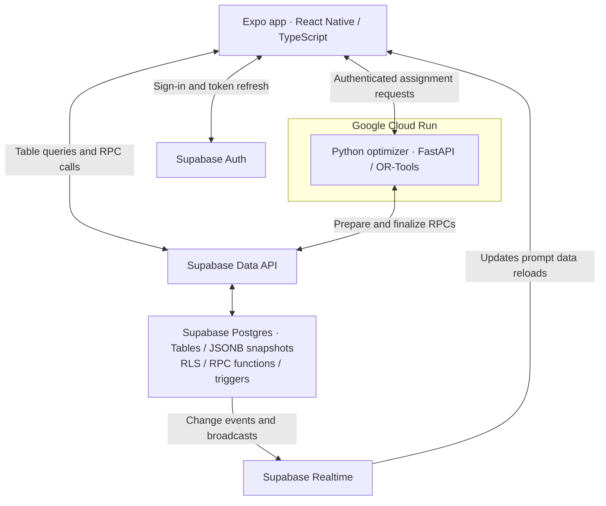
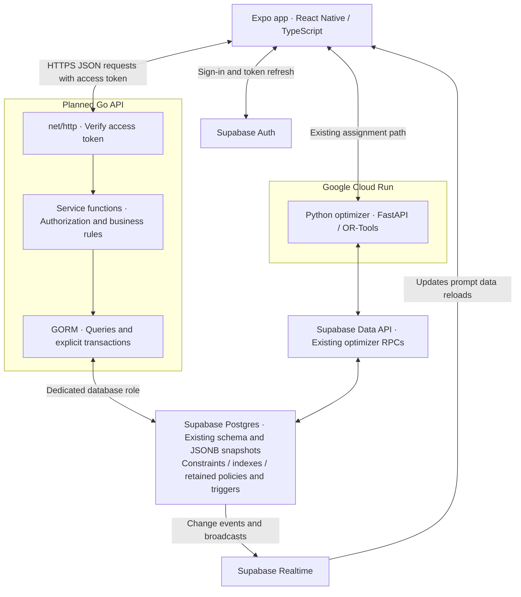

# NurseFlow

NurseFlow is a React Native mobile app built with Expo and TypeScript.

The app helps hospital charge nurses manage floor setup, shift assignments, patient acuity, nurse workloads, and related shift workflow.

## App Overview

NurseFlow is designed for charge nurses who need a clearer way to organize a hospital floor before and during a shift.

The app supports:

- Floor setup with rooms, beds, and doctor sides.
- Shift setup from a reusable floor template.
- Nurse profiles with license type, experience level, and max patient load.
- Patient entry with bed location, initials, age, sex, diagnosis, and acuity.
- Assignment logic that balances nurse teams, room coverage, and bed-level patient assignments.
- A compact charge nurse floor board for reviewing census, acuity, nurse workload, unassigned beds, and imbalance flags.

## Architecture

### Current architecture

The Expo app uses Supabase Auth for login and accesses application data through
Supabase's Data API. Postgres holds the data, RLS policies, PL/pgSQL workflow
functions, and triggers. A separate Python optimizer runs on Google Cloud Run.



### Planned Go architecture

The planned Go API uses `net/http` for HTTP handling, service functions for
authorization and business logic, and GORM for Postgres access. Supabase Auth,
Realtime, and the Python optimizer remain separate services. The Go API is not
implemented yet.



## Setup

### Requirements

- Node.js installed.
- npm installed.
- A configured Supabase project and optimizer service.
- An Android emulator, iOS simulator, development build on a phone, or web browser.

### Install Dependencies

```bash
npm install
```

### Configure Environment

Copy `.env.example` to `.env` and set:

```dotenv
EXPO_PUBLIC_SUPABASE_URL=https://your-project-ref.supabase.co
EXPO_PUBLIC_SUPABASE_PUBLISHABLE_KEY=your-publishable-key
EXPO_PUBLIC_OPTIMIZER_SERVICE_URL=https://your-optimizer-service.example
```

Use the Supabase publishable key in the app. Database credentials and secret keys
belong only on the backend. Restart Expo after changing these values.

For backend setup, see the [Supabase setup guide](docs/phase-5/supabase-auth-setup.md)
and [optimizer service instructions](optimizer-service/README.md).

### Start The App

```bash
npm start
```

Expo will show the available development targets.

### Useful Commands

```bash
npm run android
npm run ios
npm run web
npm run lint
```
